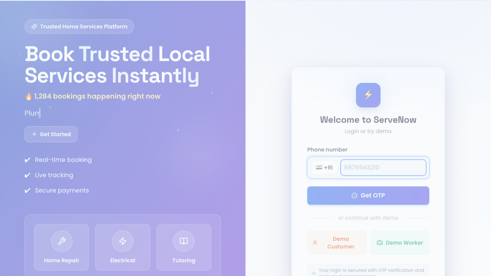
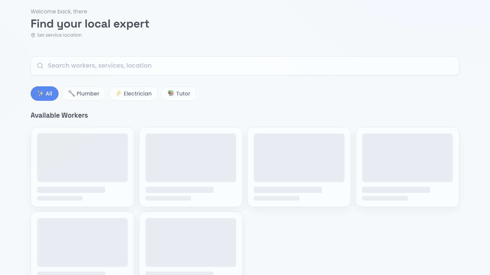

# ServeNow — HyperLocal Service Marketplace

A full-stack, production-grade platform connecting customers with verified local service workers (plumbers, electricians, tutors, etc.) — with real-time job tracking, OTP auth, and Razorpay payments.

## Tech Stack

| Layer | Tech |
|---|---|
| Frontend | Next.js 14 (App Router) |
| Backend | Node.js + Express |
| Database | PostgreSQL (Neon.tech) |
| Cache / Locks | Redis (Railway) |
| Real-time | Socket.io |
| Auth | OTP via MSG91 + JWT |
| Payments | Razorpay |
| Maps | Google Maps JS API + Places API |
| Email | Resend |
| Deploy | Vercel (frontend) + Railway (backend) |

---

## Project Structure

```
ServeNow/
├── frontend/
│   ├── app/
│   │   ├── (auth)/
│   │   │   ├── login/page.tsx
│   │   │   └── verify/page.tsx
│   │   ├── (customer)/
│   │   │   ├── page.tsx                  ← Home / search
│   │   │   ├── services/[category]/page.tsx
│   │   │   ├── book/[workerId]/page.tsx
│   │   │   ├── track/[jobId]/page.tsx
│   │   │   └── dashboard/page.tsx
│   │   ├── (worker)/
│   │   │   ├── worker/dashboard/page.tsx
│   │   │   └── worker/jobs/page.tsx
│   │   ├── admin/
│   │   │   └── page.tsx
│   │   ├── layout.tsx
│   │   └── globals.css
│   ├── components/
│   │   ├── ui/
│   │   ├── MapView.tsx
│   │   ├── BookingCard.tsx
│   │   ├── WorkerCard.tsx
│   │   └── LiveTracker.tsx
│   ├── lib/
│   │   ├── api.ts
│   │   ├── socket.ts
│   │   └── utils.ts
│   ├── hooks/
│   │   ├── useSocket.ts
│   │   └── useAuth.ts
│   └── package.json
│
├── backend/
│   ├── src/
│   │   ├── index.ts                      ← Express entry + Socket.io
│   │   ├── db/
│   │   │   ├── client.ts                 ← Postgres pool
│   │   │   ├── redis.ts                  ← Redis client
│   │   │   └── schema.sql                ← Full DB schema
│   │   ├── middleware/
│   │   │   ├── auth.ts                   ← JWT verify
│   │   │   └── rateLimiter.ts
│   │   ├── routes/
│   │   │   ├── auth.ts                   ← OTP send/verify
│   │   │   ├── services.ts               ← Browse categories/workers
│   │   │   ├── bookings.ts               ← Create/manage bookings
│   │   │   ├── jobs.ts                   ← Worker job actions
│   │   │   ├── payments.ts               ← Razorpay order + webhook
│   │   │   ├── reviews.ts
│   │   │   └── admin.ts
│   │   ├── socket/
│   │   │   └── handlers.ts               ← Socket.io events
│   │   └── utils/
│   │       ├── msg91.ts                  ← OTP helper
│   │       ├── resend.ts                 ← Email helper
│   │       └── maps.ts                   ← Google Maps helper
│   ├── package.json
│   └── tsconfig.json
│
├── .env.example
└── README.md
```

---

## Quick Start

### 0. Workspace shortcut (recommended)

```bash
cd ServeNow
npm install
npm run dev
```

This starts backend and frontend together from the repository root.
Before startup, a preflight cleanup clears stale processes on ports `3000` and `4000` to reduce `EADDRINUSE` failures.

If needed, you can run cleanup manually:

```bash
npm run dev:clean
```

Run only one startup mode at a time:

- Use `npm run dev` for full stack.
- Use `npm run dev:backend` or `npm run dev:frontend` for single service debugging.
- Avoid launching `backend` separately if `npm run dev` is already running.

### 1. Clone and install

```bash
git clone <your-repo>
cd ServeNow

# Backend
cd backend && npm install

# Frontend
cd ../frontend && npm install
```

### 2. Set environment variables

Copy `.env.example` to `.env` in both `backend/` and `frontend/`.

### 3. Set up database

```bash
cd backend
npx ts-node src/db/schema.sql   # or run SQL in Neon console
```

### 4. Run locally

```bash
# Terminal 1 — backend
cd backend && npm run dev

# Terminal 2 — frontend
cd frontend && npm run dev
```

### 5. Demo readiness checklist

Run through [DEMO_CHECKLIST.md](DEMO_CHECKLIST.md) before sharing with recruiters/interviewers.

---

## Deployment

- **Frontend (Free)** → Vercel free tier.
- **Backend (Free)** → Render free web service (`render.yaml` included).
- **Database (Free)** → Neon free Postgres.
- **Redis (Free)** → Upstash free Redis (or Railway trial/free credits).

Use the full step-by-step checklist in [FREE_DEPLOYMENT.md](FREE_DEPLOYMENT.md).

---

## Real Data Sources Used

| Source | Used For |
|---|---|
| Google Places API | Real locality autocomplete, map pins |
| India Pincode API (api.postalpincode.in) | Pincode → area/city resolution |
| MSG91 | Live OTP SMS to real Indian phone numbers |
| Razorpay Test Mode | Real payment gateway flow (test keys) |

---

## Key Features

- OTP-based login (no passwords — like every Indian app)
- Real-time slot availability with Redis distributed locking (no double bookings)
- Live job tracking on Google Maps via Socket.io
- Razorpay payment + webhook for confirmed payment state
- Worker earnings dashboard + payout requests
- Review system (only after confirmed job completion)
- Admin panel with platform metrics

---

## Main Add-ons Highlights

- Smart marketplace job flow
	- Worker incoming queue via `GET /jobs/available` with REQUESTED-state mapping.
	- Worker actions: accept, reject, arriving, start, complete with real-time updates.

- Auto-assignment engine
	- Customer booking can auto-assign nearest available worker by category and location.
	- Socket notification is pushed to assigned worker immediately.

- Availability system upgrades
	- Worker recurring schedule management (`worker_availability`) with API support.
	- Materialized `availability_slots` generated for upcoming dates.
	- Blocked-slot handling with graceful compatibility checks.

- Notification persistence
	- Critical booking/job lifecycle events now write to DB notifications (not socket-only).
	- Notifications tab can show durable event history.

- Admin quality-of-life controls
	- "Show real only" filter for bookings to exclude simulation data.
	- Heatmap and realtime dashboard activity improvements.

- Simulation isolation
	- `bookings.is_simulated` flag added.
	- Simulation-generated records are marked and filterable.

- Resilience and DX improvements
	- Better timeout handling and clearer frontend error states.
	- Startup/schema compatibility helpers for local drift scenarios.

---

## Screenshots

Latest live screenshots captured from the deployed app:





Current committed visual assets:


---

## Demo Flow (Recruiter / Interview Ready)

Use this sequence for a smooth 3-5 minute product walkthrough.

### 1. Start the platform

```bash
npm run dev
```

- Frontend: `http://localhost:3000`
- Backend API: `http://localhost:4000`

### 2. Login quickly with demo mode

- Open Login page and use:
	- Demo Customer
	- Demo Worker
- No manual OTP entry needed for the guided demo path.

### 3. Customer journey

1. Go to home/services and pick a category.
2. Open a worker profile and create a booking.
3. Show price context/surge info and booking confirmation.
4. Open tracking screen to watch status progression.

### 4. Worker journey

1. Open worker dashboard.
2. Show incoming REQUESTED jobs.
3. Accept job, mark arriving, start, and complete.
4. Show earnings cards and job history updates.

### 5. Admin journey

1. Open admin dashboard for live metrics.
2. Open bookings tab and toggle "Show real only".
3. Open heatmap view for demand/supply visibility.
4. Optionally run guided scenario from admin panel.

### 6. Key proof points to mention while demoing

- Real-time socket updates across customer, worker, and admin views.
- Booking lifecycle FSM: pending → accepted → arriving → in_progress → completed.
- Persistent notifications written to database (not socket-only).
- Simulation bookings are isolated via `is_simulated` and filterable in admin.
- Availability management supports recurring schedule + blocked slots.
